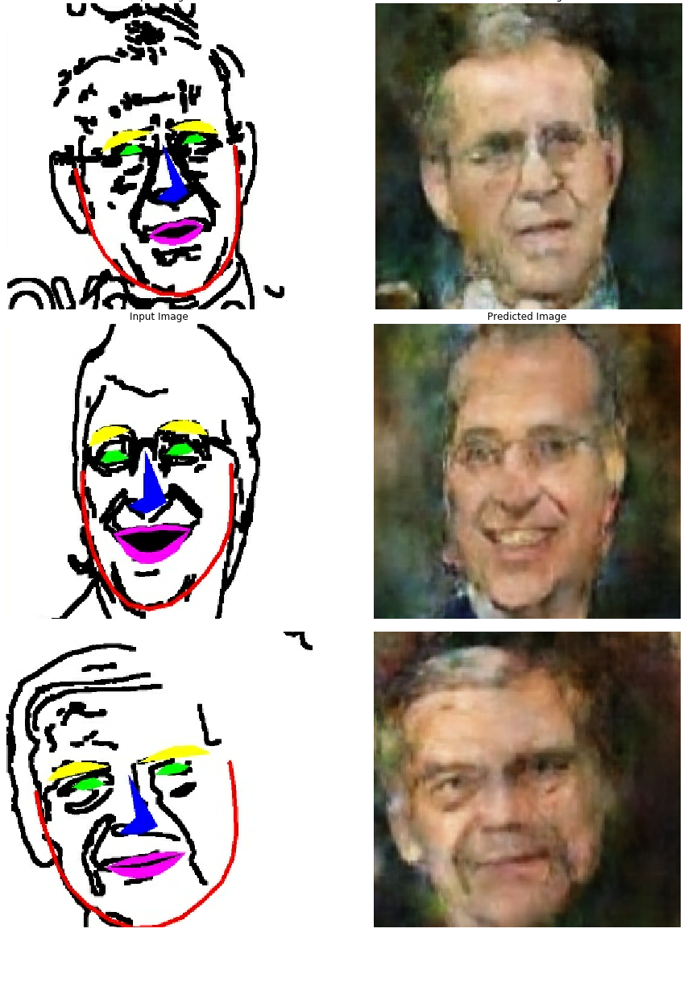

# sketchy
Proyecto que busca crear un generador de caras realistas a partir de dibujos creados por el usuario

# Abstract
Sketchy utiliza una serie de filtros morfologicos de elaboracion propia junto con un detector preentrenado [1] para generar un dibujo a partir de una imagen real de una cara humana, esto permite generar el dataset Requerido de manera No supervisada, y posterior a esto utilizar Pix2pix para realizar el proceso inverso

# Steps
* Generacion del Dataset de forma no supervisada utilizando el conjunto de imagenes de [2]
* Traduccion del dominio de Dibujo a Caras_realistas usando Pix2pix

# Archivos requeridos para Training 
* Face detector file in "/tools"
* 68 landmark detector file in "/tools"
* Dataset original es descargado en la primera linea del codigo 
* Modelo Final .h5 en "/models"
* Si ya cuenta con tools.zip, solo coloque dicho archivo en la raiz de Colab y deje correr el Script sketchy_final.py

# Resultados 

# Referencias
1. Kazemi, V., & Sullivan, J. (2014). One millisecond face alignment with an ensemble of regression trees. 2014 IEEE Conference on Computer Vision and Pattern Recognition, 1867-1874.
2. Gary B. Huang, Manu Ramesh, Tamara Berg, and Erik Learned-Miller.
Labeled Faces in the Wild: A Database for Studying Face Recognition in Unconstrained Environments.
University of Massachusetts, Amherst, Technical Report 07-49, October, 2007.

